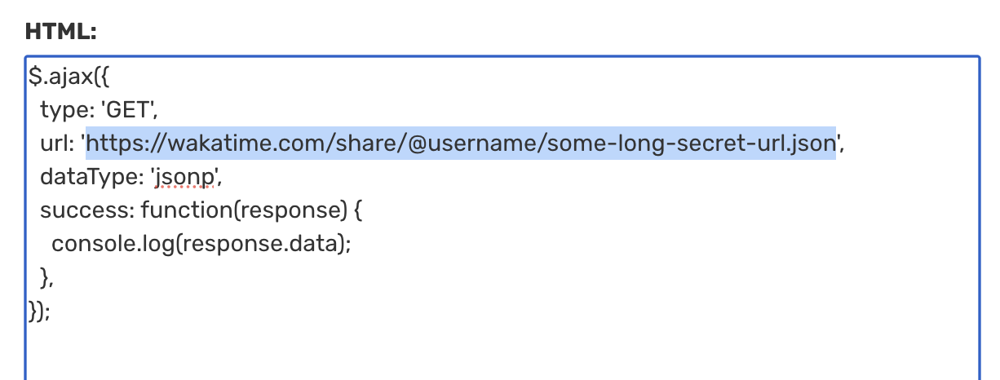

# wakatime-json-viewer

Visualize JSON data exported from WakaTime

## How do I use this?

1. Clone the repository
1. Open `public/config.json` and [enter the links to your embeddables](#getting-your-embeddables)
1. Install dependencies (`npm i`/`yarn install`/`pnpm i`/`bun i`)
1. Run the dev script (`npm run dev`/`yarn run dev`/`pnpm run dev`/`bun run dev`)
1. Visit http://localhost:3000, and see your stats!

## What does it show?

- A language pie chart for 7 day, 30 day, 1 year, and all-time (with time spent on each language!)
- All-time line chart for daily totals:
- - per language
- - per operating system
- - per editor
- - and totals

## Getting your embeddables

1. Go to [your embeddables](https://wakatime.com/share/embed)
1. Select JSON as the format
1. Select "Coding Activity (Table)" with the date range "All Time"
1. Click "Get Embeddable Code"
1. Select the `url` _only_, as shown:
   
1. In `public/config.json`, fill the "totals" field with your URL
1. Repeat steps 3-6, using the chart types "Languages" and "Operating Systems", filling in the corresponding fields in `public/config.json` with the URLs
  - "langs" for languages, "oses" for operating systems, and "editors" for editors
1. You should end up with something like
    ```json
    {
      "totals": "https://wakatime.com/share/@user/long-name.json",
      "langs": "https://wakatime.com/share/@user/long-name.json",
      "oses": "https://wakatime.com/share/@user/long-name.json",
      "editors": "https://wakatime.com/share/@user/long-name.json",
    }
    ```

---

Feel free to open an issue on _anything_ you want (that's at least somewhat related to this project. so don't open an issue on how bad store-bought hummus is)

_Version: 0.1_
